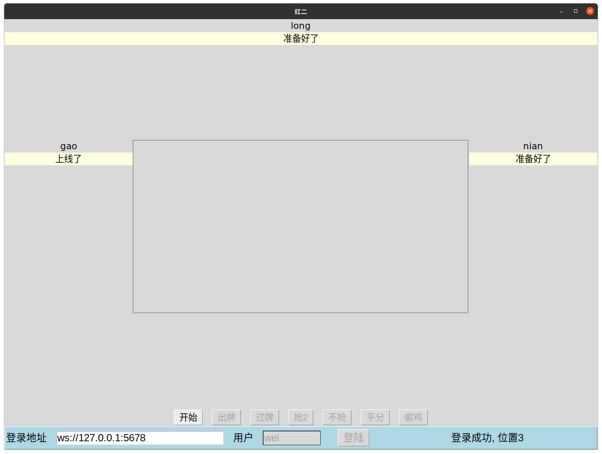
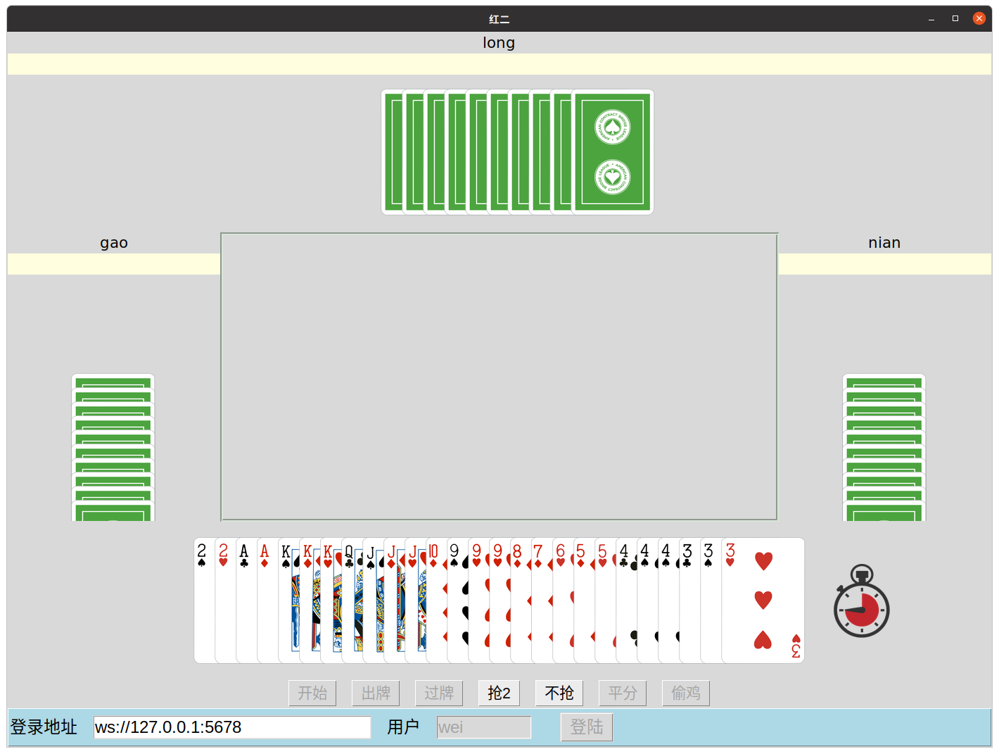
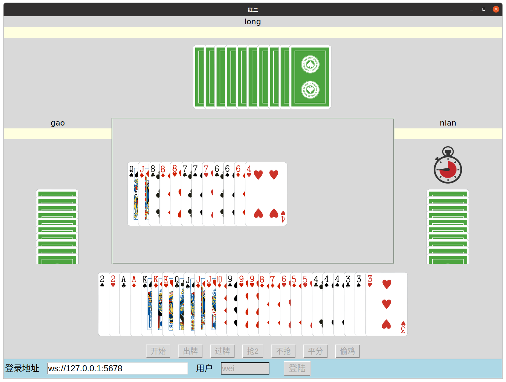
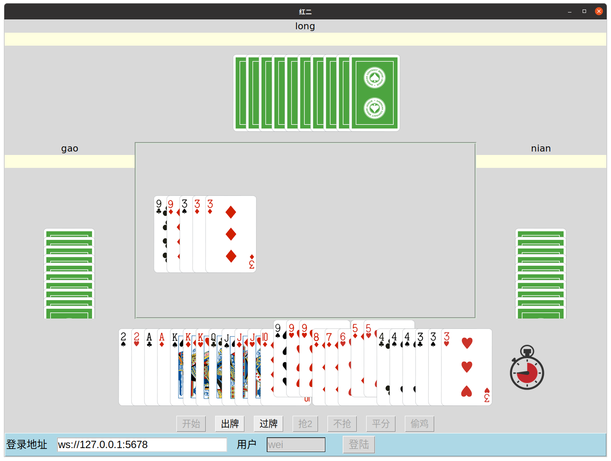

# 红2 （四人斗地主)
## 基本架构
Client[python tkinter]  < --- websocket ---> Server[python asyncio]
UI Thread and Com Thread                            SingleThread

## 玩法介绍
+ 一种类似四人斗地主的棋牌游戏，总计使用两副牌，去掉四个大小王，每人初始26张牌。
+ 有红桃2的为一组，没有的为一组，出牌规则与斗地主类似。
	+ 四张及以上同值牌面组成炸弹， 比如5个3， 6个Q， 4个K等。
	+ 一对红2为最大王炸。
	+ 单张红2大于普通红。
	+ 顺子最少为6张（斗地主为5张），可以三带一，三带二，飞机（至少两个三带1/2)，连对（至少三对）等。
	+ 其他大小规则与斗地主一样， 先出完为胜。
+ 发完牌后可以一人抢王炸，有红桃2的要让出，进行1v3模式，哪边先出完一个用户哪边胜利，没有平局。也可以普通的2v2模式，按出完顺序1 2 3 4，和最小一方为胜利方。
+ 如果无人抢王炸，一个玩家有双红桃2，可以让一个出来给对家，立马区分敌我。可以不让，类似偷鸡模式，结局按1v3模式计算。
+ 通常就是2v2，除上面让一个红2的情况大家一开始知道敌我双方，否则大家都不知道谁和谁是一伙的。

## 一些运行截图

## 如何运行
请看install.txt安装相应的组件。
### 服务端 
直接运行new_server.py
### 客户端
直接运行gui.py
#### [Android 客户端](https://github.com/RockZhangCn/Red2-Android-Client)
#### Android客户端运行截图

